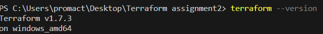
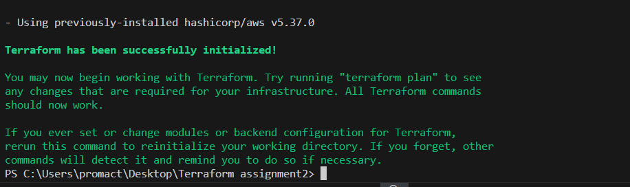
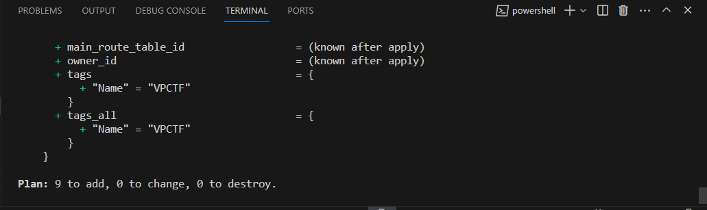
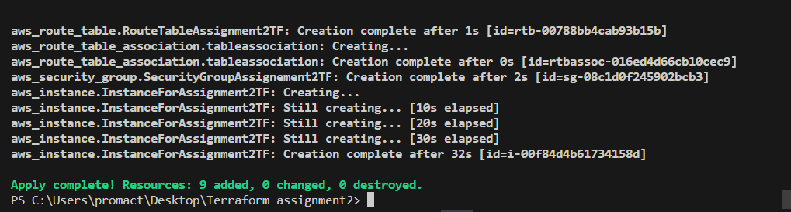
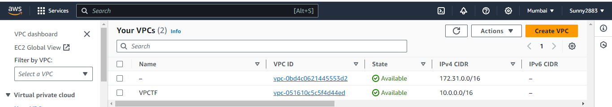
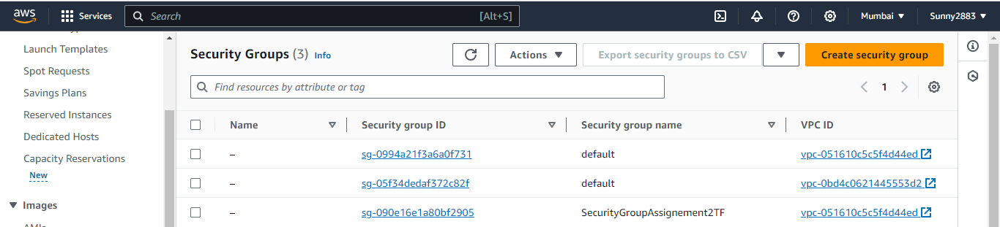
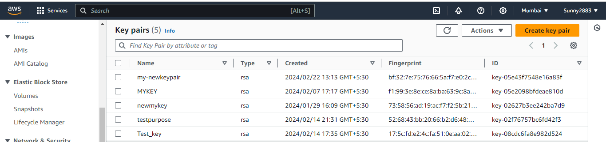

                Terraform with Variables and Dependencies

Objective: Create a Terraform configuration that uses variables and demonstrates the dependency between two services.

Description:

This assignment involves creating a Terraform configuration to provision two AWS resources: an S3 bucket and an EC2 instance. The configuration will utilize Terraform variables to parameterize settings such as the S3 bucket name. Additionally, the EC2 instance will be set to depend on the S3 bucket, ensuring proper resource sequencing during provisioning.

Overview:

The Terraform configuration defines the infrastructure resources needed for the assignment, including an S3 bucket and an EC2 instance.

Terraform variables are employed to parameterize the configuration, facilitating easy customization of settings such as the S3 bucket name.

Resource dependencies are established within the configuration, ensuring that the EC2 instance is provisioned only after the S3 bucket creation is successfully completed.

To utilize the configuration, users can modify the Terraform variables according to their requirements and execute the standard Terraform workflow, including initialization, planning, and applying the configuration.

Requirements -• Terraform v1.7.3 installed on Windows_amd64.

|Resource|Version|
|--|--|
|terraform|v1.7.3|

Create a new directory for your Terraform assignment.
-	mkdir Terraform assignment2
-	cd Terraform assignment2

Create a variables.tf file to define Terraform variables.
|Variable name|Type|
|--|--|
|S3_bucket_name|String|
|Instance ami|String|
|Instance name|String|
|Instance type|String|
|Region|String|

Then, create a terraform.tfvars file and assign values to those variables."
|Variable name|Value|
|--|--|
|s3_bucket_name|"s3bucketbytf"|
|instance_ami|"ami-06b72b3b2a773be2b"|
|Instance_name|"InstanceforAssignement2TF"|
|instance_type|"t2.micro"|
|region|"ap-south-1"|

Create a key pair for the instance.
|Name|Value|
|--|--|
|Name|my-newkeypair|

Create a s3Bucket using aws_s3_bucket resource.
|Name|Value|
|--|--|
|bucket| var.s3_bucket_name|

Create a Virtual Private Cloud (VPC) along with a subnet, internet gateway, and route table.
|Resopurce type|Name|
|--|--|
|aws_vpc|VPCTF|
|--|--|
|cidr_block|"10.0.0.0/16"|
|instance_tenancy|"default"|
|tags: Name|"VPCTF"|

|Resopurce type|Name|
|--|--|
|aws_subnet|subnetTF|
|--|--|
|vpc_id|aws_vpc.VPCTF.id|
|cidr_block|"10.0.1.0/24"|
|availability_zone| "ap-south-1a"|
|tags: Name|"subnetTF"|

|Resopurce type|Name|
|--|--|
|aws_internet_gateway|gwTF|
|--|--|
|vpc_id|aws_vpc.VPCTF.id|
|tags:name|"gwTF"|

|Resopurce type|Name|
|--|--|
|aws_route_table|RouteTableAssignment2TF|
|--|--|
|vpc_id|aws_vpc.VPCTF.id|
|cidr_block:|"0.0.0.0/0"|
|gateway_id|aws_internet_gateway.gwTF.id|
|tags:name|routeTF|

|Resopurce type|Name|
|--|--|
|aws_route_table_association|tableassociation|
|--|--|
|subnet_id|aws_subnet.subnetTF.id|
|route_table_id|aws_route_table.RouteTableAssignment2TF.id|

Then, create an AWS instance and associate it with a key pair, security group, VPC, AMI, and user data, ensuring it depends on the existence of the S3 bucket.

|Resource Property|Value|
|--|--|
|instance_type|var.instance_type|
|ami|var.instance_ami|
|key_name|${aws_key_pair.key-tf.key_name}|
|subnet_id|aws_subnet.subnetTF.id|
|security_groups|[aws_security_group.SecurityGroupAssignement2TF.id]|
|associate_public_ip_address|true|
|tags:Name |var.Instance_name|
|depends_on|[aws_s3_bucket.BucketByTF]|

Initialize the Terraform working directory to download necessary plugins and modules.

•	terraform init

terraform init:

Purpose: Initialize a Terraform project in a directory.

Usage: Run terraform init in the root directory of your Terraform configuration files.
Functionality: Downloads necessary plugins and modules specified in the configuration files. Sets up the working directory and prepares it for Terraform's use.

Example Usage: Use terraform init to initialize the Terraform environment before starting any infrastructure provisioning or management tasks.

Generate an execution plan to review the changes Terraform will make.

•	terraform plan

Purpose: Generate an execution plan for changes to the infrastructure.

Usage: Run terraform plan after initializing the Terraform project.

Functionality: Analyzes the current state of the infrastructure and compares it to the desired state specified in the configuration files. Provides a preview of the actions Terraform will take to achieve the desired state.

Apply the Terraform configuration to create the AWS resources.

•	terraform apply

Purpose: Apply changes to the infrastructure according to the Terraform configuration.

Usage: Run terraform apply after reviewing the execution plan.

Functionality: Executes the planned actions generated during the planning phase. Creates, modifies, or deletes resources as specified in the configuration files. Updates the Terraform state file to reflect the changes made to the infrastructure.

Example Usage: Apply the changes to the infrastructure by running terraform apply after confirming the execution plan.

final output:

